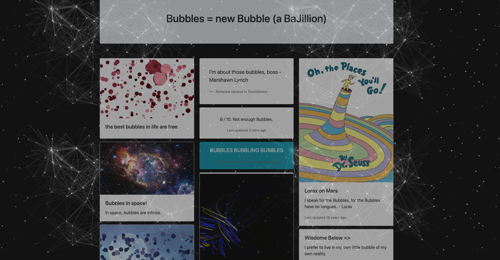
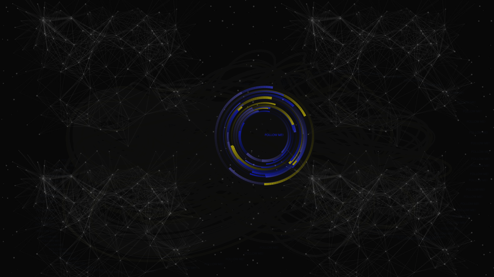

# Bubbles = new Bubble (a BaJillion)
Usage of Node.js and Express framework for web applications; Project use bubble as a theme, achieving bunch of  bubble animations by using HTML Canvas and javascript.

